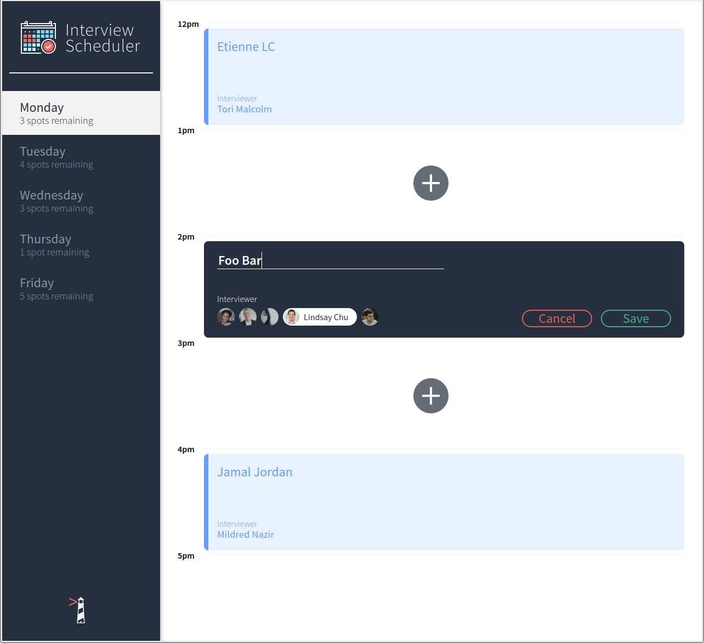
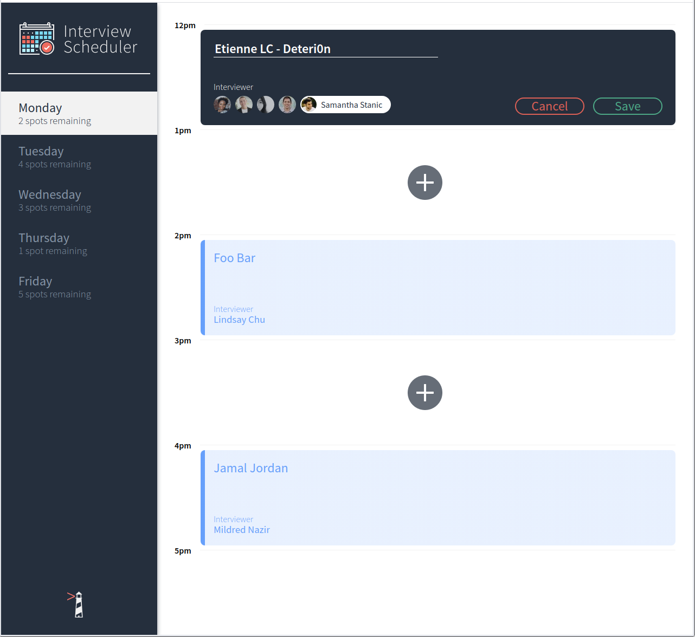
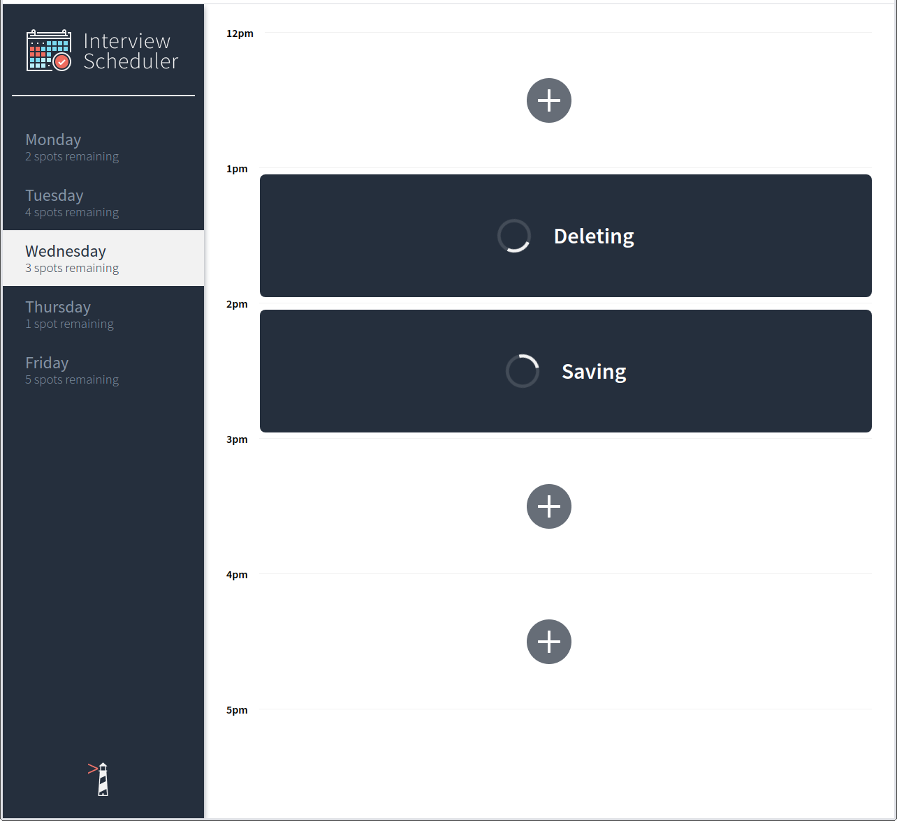
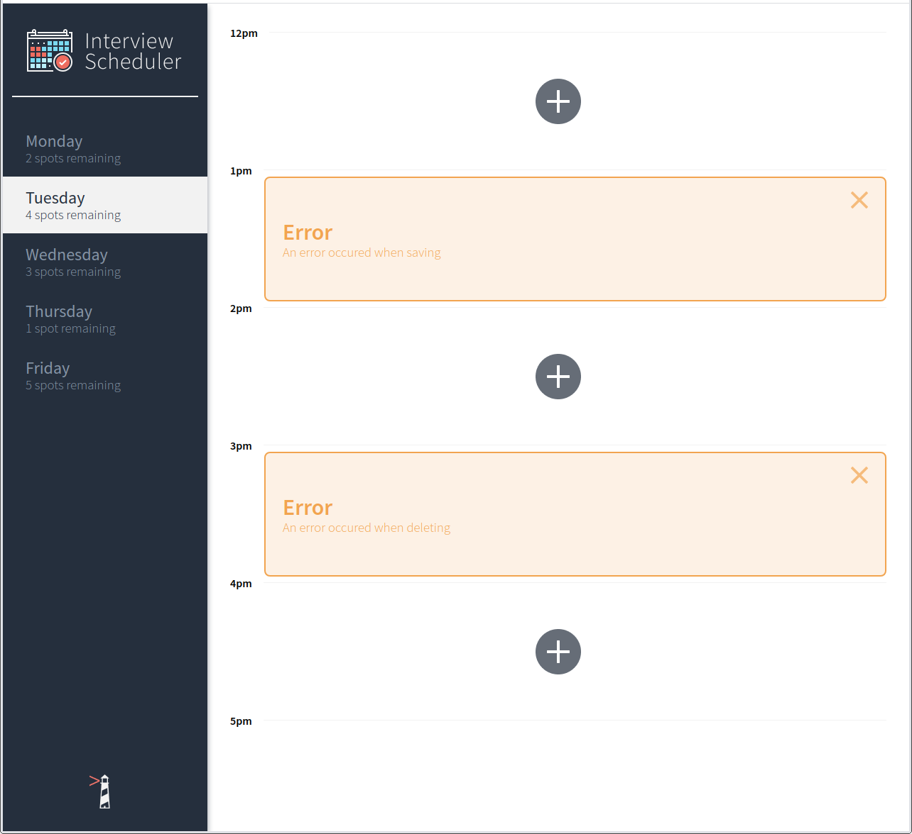

# Interview Scheduler

Scheduler is a simple, single-page app build with react that allows the user to book interviews with mentors.

This project made me practice my React, HTML, JS and AJAX (Axios) front-end skills but also backend skills when working on the API (Node, PSQL).

## Notes:
- Known issue  : when the user books an interview without selecting a mentor. Adding a verification should be the next step.






## Setup

Install dependencies with `npm install`.

## Running Webpack Development Server

```sh
npm start
```

## Running Jest Test Framework

```sh
npm test
```

## Running Storybook Visual Testbed

```sh
npm run storybook
```

## Dependencies

- Node 5.10.x or above
- "axios": "^0.21.0",
- "classnames": "^2.2.6",
- "normalize.css": "^8.0.1",
- "react": "^16.9.0",
- "react-dom": "^16.9.0",
- "react-scripts": "3.0.0"